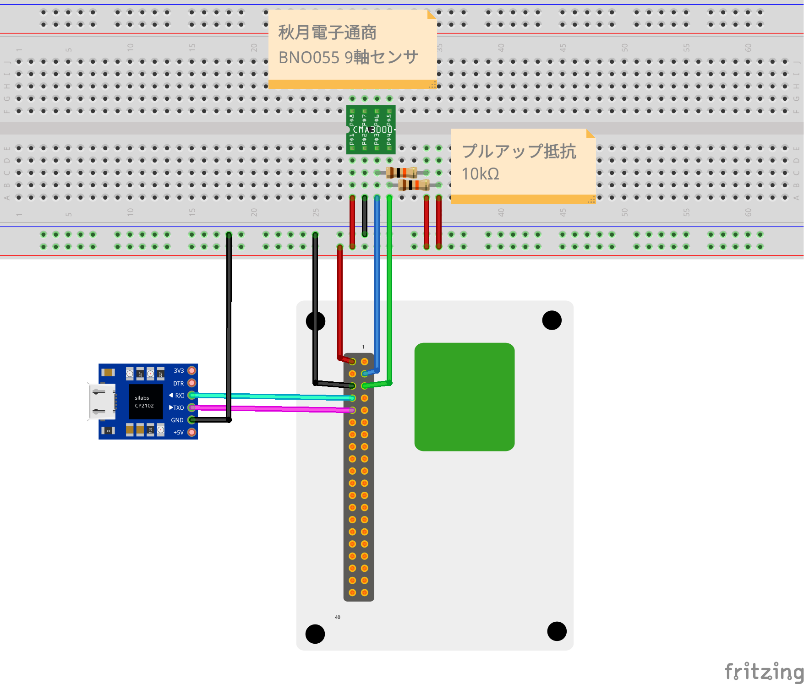

Wio Terminalに秋月電子のBNO055使用9軸センサーフュージョンモジュールキットを接続して、Rustのプログラムで値を測定してみました。

## 使用パーツ

* [Wio Terminal](https://www.switch-science.com/catalog/6360/)
* [Wio Terminal バッテリーベース](https://www.switch-science.com/catalog/6816/)
* [ＢＮＯ０５５使用　９軸センサーフュージョンモジュールキット](https://akizukidenshi.com/catalog/g/gK-16996/)
* [USBシリアル変換モジュール(通販コード:M-11007)](https://akizukidenshi.com/catalog/g/gM-11007/)
* [10kΩ抵抗](2個)

## 接続図



秋月電子のキットはSCL/SDAはプルアップが必要なのですが、RustでWio Terminal側のSCL/SDA用のピンをプルアップし、かつI2Cバスに設定する方法が分からなかったので、物理的に抵抗を追加しています。(Arduinoで開発する場合は不要です。また、[Adafruit BNO055搭載 9DoF 方位/慣性計測モジュール](https://www.switch-science.com/products/5511)にはモジュール側にチップ抵抗があるようなので抵抗の追加は不要だと思われます)

## プロジェクト設定

通常の組み込み用の依存パッケージの他に、BNO055用のライブラリ`bno055`、測定データの取得用に`mint`を追加しています。

```toml:Cargo.toml
[package]
authors = ["HORIE Tetsuya <horie-t@users.noreply.github.com>"]
name = "nine-axis-sensor"
edition = "2018"
version = "0.1.0"

[dependencies]
panic-halt = "0.2"
wio_terminal = "0.4.0"
embedded-hal = "0.2.4"
cortex-m = "0.6.4"
cortex-m-rt = "0.6.13"
heapless = "0.5.6"
bno055 = "0.3.3"
mint = "0.5.9"
```

## ソースコード

後述のコードの様に、

1. Bno055のインスタンスを作成して、`init()`を呼び出し初期化
2. `set_mode()`で測定のモードを設定(ここでは9軸の測定結果をまとめた値を取得する設定にしています)
3. `quaternion()`を呼び出し、姿勢を取得

していきます。(ここでは予めI2Cのインスタンスを作成しておいて`new()`の引数に渡してします。)


```rust
use bno055;

    let mut imu = bno055::Bno055::new(i2c).with_alternative_address();
    imu.init(&mut delay).unwrap();

    imu.set_mode(bno055::BNO055OperationMode::NDOF, &mut delay).unwrap();

    loop {
        if let Some(quat) = imu.quaternion().ok() {
            writeln!(&mut serial, "x: {}, y: {}, z: {}, s{}\r", quat.v.x, quat.v.y, quat.v.z, quat.s).unwrap();
        };
        delay.delay_ms(2000u32);
    }
```

全体は以下の通りです。

```rust:src/main.rs
#![no_std]
#![no_main]

use panic_halt as _;
use core::fmt::Write;
use embedded_hal::blocking::delay::DelayMs;

use bno055;

use wio_terminal as wio;
use wio::hal::clock::GenericClockController;
use wio::hal::delay::Delay;
use wio::hal::gpio::*;
use wio::hal::sercom::{I2CMaster3, PadPin, Sercom3Pad0, Sercom3Pad1};
use wio::pac::{CorePeripherals, Peripherals};
use wio::prelude::*;
use wio::{Pins, UART, entry};


#[entry]
fn main() -> ! {
    // 初期化処理
    let mut peripherals = Peripherals::take().unwrap();
    let core = CorePeripherals::take().unwrap();
    let mut clocks = GenericClockController::with_external_32kosc(
        peripherals.GCLK,
        &mut peripherals.MCLK,
        &mut peripherals.OSC32KCTRL,
        &mut peripherals.OSCCTRL,
        &mut peripherals.NVMCTRL,
    );
    let mut delay = Delay::new(core.SYST, &mut clocks);    
    let gclk0 = &clocks.gclk0();

    let mut pins = Pins::new(peripherals.PORT);

    let uart = UART {
        tx: pins.txd,
        rx: pins.rxd
    };
    let mut serial = uart.init(
        &mut clocks,
        115200.hz(),
        peripherals.SERCOM2,
        &mut peripherals.MCLK,
        &mut pins.port
    );

    delay.delay_ms(1000u32);

    let i2c: I2CMaster3<
        Sercom3Pad0<Pa17<PfD>>,
        Sercom3Pad1<Pa16<PfD>>
    > = I2CMaster3::new(
        &clocks.sercom3_core(&gclk0).unwrap(),
        400.khz(),
        peripherals.SERCOM3,
        &mut peripherals.MCLK,
        pins.i2c1_sda.into_pad(&mut pins.port),
        pins.i2c1_scl.into_pad(&mut pins.port)
    );

    delay.delay_ms(1000u32);
    writeln!(&mut serial, "Hello, {}!\r", "tarf").unwrap();

    let mut imu = bno055::Bno055::new(i2c).with_alternative_address();
    imu.init(&mut delay).unwrap();
    writeln!(&mut serial, "BNO055 intialized.\r").unwrap();

    imu.set_mode(bno055::BNO055OperationMode::NDOF, &mut delay).unwrap();
    writeln!(&mut serial, "BNO055 NDOF Mode.\r").unwrap();

    loop {
        if let Some(quat) = imu.quaternion().ok() {
            writeln!(&mut serial, "x: {}, y: {}, z: {}, s{}\r", quat.v.x, quat.v.y, quat.v.z, quat.s).unwrap();
        };
        delay.delay_ms(2000u32);
    }
}
```